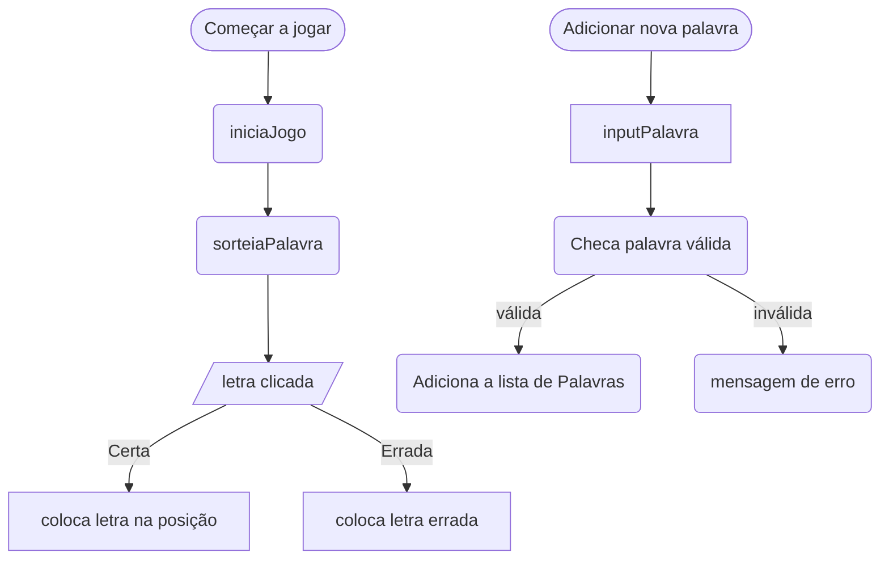

# challenge-oracle-hangman
Challenge Oracle ONE Semana 03 e 04: Crie seu próprio jogo da forca com Javascript

```mermaid
    flowchart TD
    A([Começar a jogar]) --> B(iniciaJogo)
    B --> C(sorteiaPalavra)
    C --> D[/letra clicada/]
    D -->|Certa| E[coloca letra na posição]
    D -->|Errada| F[coloca letra errada]
    R([Adicionar nova palavra]) -->S[inputPalavra]
    S -->T(Checa palavra válida)
    T -->|válida| U(Adiciona a lista de Palavras)
    T -->|inválida| V(mensagem de erro)
```